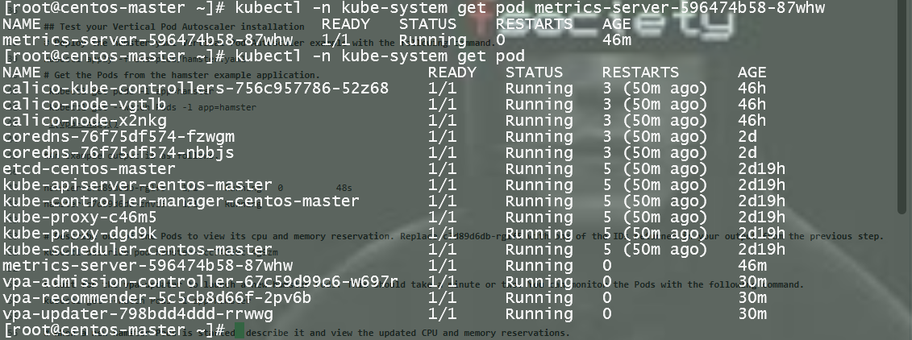
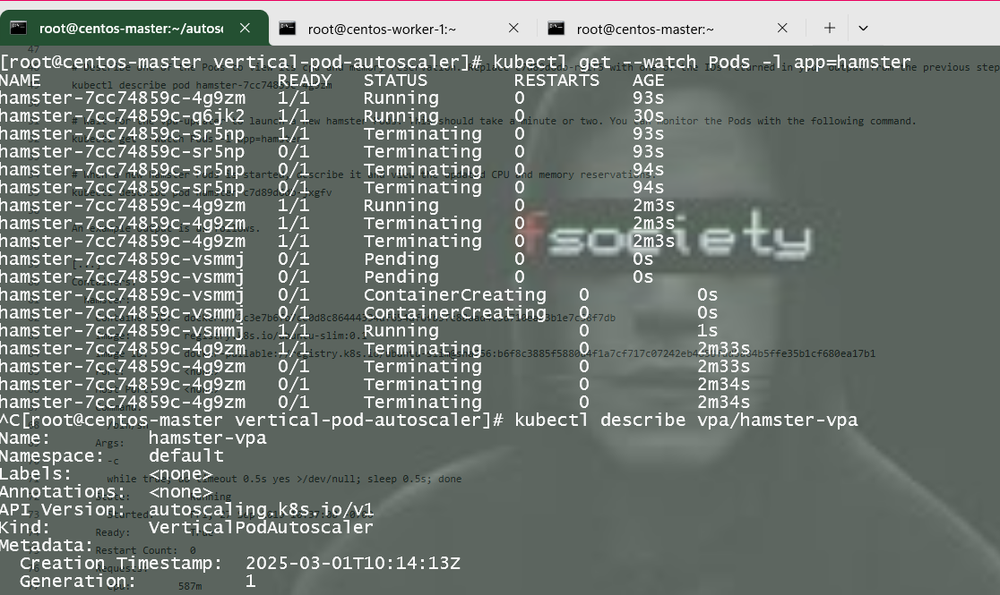

# Kubernetes Metrics Server and Vertical Pod Autoscaler Setup

This guide helps you set up the **Metrics Server** and **Vertical Pod Autoscaler (VPA)** for monitoring and adjusting Kubernetes pod resources. The steps involve installing the Metrics Server, verifying its operation, and deploying and testing the Vertical Pod Autoscaler.

## Prerequisites
- A running Kubernetes cluster
- `kubectl` CLI configured to interact with the cluster
- Access to the internet to download required components

## 1. Install Metrics Server

The Metrics Server collects and provides resource usage data (like CPU and memory) for your cluster nodes and pods.

### Install Dependencies
Ensure you have `wget` installed on your system:

```bash
yum install -y wget
```

### Download Metrics Server YAML

Download the latest release of the `components.yaml` manifest from the official Metrics Server GitHub repository:

```bash
wget https://github.com/kubernetes-sigs/metrics-server/releases/latest/download/components.yaml
```

### Edit the YAML Configuration

Open the `components.yaml` file for editing:

```bash
vim components.yaml
```

Locate the section for the Kubelet configuration and add the following argument to allow insecure TLS communication:

```yaml
- --kubelet-insecure-tls
```

### Apply the Metrics Server Configuration

Deploy the Metrics Server using the `components.yaml`:

```bash
kubectl apply -f components.yaml
```

### Verify Metrics Server Installation

Check if the Metrics Server pod is running:

```bash
kubectl get pod -n kube-system metrics-server-*
```

Describe the Metrics Server pod:

```bash
kubectl -n kube-system describe pod metrics-server-<pod-name>
```

Verify that the Metrics Server is working properly by checking the resource metrics:

```bash
kubectl top nodes
kubectl top pod -A
```

## 2. Install Vertical Pod Autoscaler (VPA)

The Vertical Pod Autoscaler adjusts pod resource requests (CPU and memory) based on usage patterns.

### Clone the Kubernetes Autoscaler Repository

Clone the `autoscaler` repository to your local machine:

```bash
git clone https://github.com/kubernetes/autoscaler.git
cd autoscaler/vertical-pod-autoscaler/
```

### Optional: Remove Previous VPA Installations

If you have previously installed a version of VPA, remove it using:

```bash
./hack/vpa-down.sh
```

### Deploy the Vertical Pod Autoscaler

Deploy the Vertical Pod Autoscaler to your cluster:

```bash
./hack/vpa-up.sh
```

Verify that the VPA pods are running:

```bash
kubectl get pods -n kube-system
```


## 3. Test Vertical Pod Autoscaler

To test the VPA installation, deploy the hamster example application:

```bash
kubectl apply -f examples/hamster.yaml
```

Check the status of the hamster pods:

```bash
kubectl get pods -l app=hamster
kubectl get --watch Pods -l app=hamster
```


### Describe the Hamster Pod

To view the CPU and memory reservations for the hamster pod, run:

```bash
kubectl describe pod hamster-<pod-id>
```

### Describe the Updated Hamster Pod

Once the new hamster pod is created, check its CPU and memory requests:

```bash
kubectl describe pod hamster-<new-pod-id>
```

### View Vertical Pod Autoscaler Status

To view the updated VPA status:

```bash
kubectl describe vpa/hamster-vpa
```

### Clean Up the Example Application

When you're finished with the hamster example, you can delete it:

```bash
kubectl delete -f examples/hamster.yaml
```

## Conclusion

I have successfully installed and tested both the Metrics Server and Vertical Pod Autoscaler. Metrics Server is providing resource usage data, and the Vertical Pod Autoscaler is adjusting resource requests for your pods based on their usage patterns.
